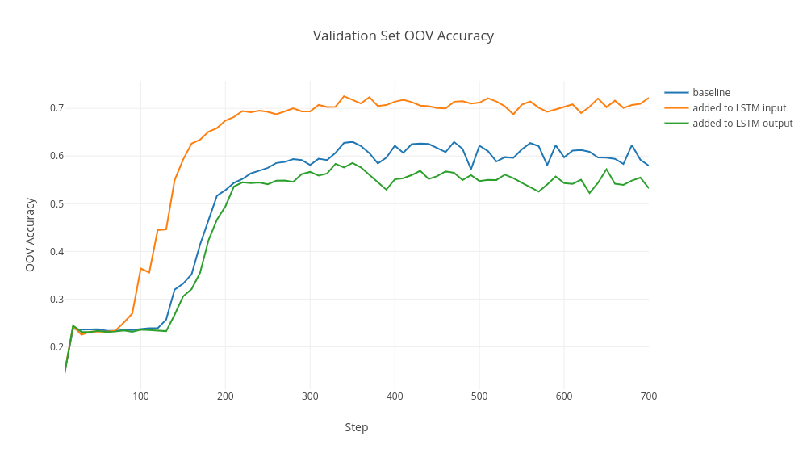

# CS388-NLP-HW2
HW2 of the Natural Language Processing course: Part-of-Speech Tagging with LSTMs

## Introduction

Part-of-Speech (POS) tagging is the lowest form of syntactic analysis of text. POS tags are useful for subsequent syntactic parsing and word sense disambiguation. POS tagging is a classic example of a sequence labelling task and Bidirectional Long Short Term Memory networks (Bi-LSTMs) can be applied to this problem. In this experiment, we extract orthographic features from each word, and investigate the effects of adding these features during training, on the predictive and run-time performance of the network. We also compare how different network architectures affects the out-of-vocabulary (OOV) accuracy of model.

## Usage

### Requirements
- Python 2.7
- Tensorflow r1.0 (works on 1.6 also)
- Tensorboard (for visualization)

### Arguments

|     Argument     |                                                     Summary                                                    |
|:----------------:|:--------------------------------------------------------------------------------------------------------------:|
|  `DATASET_PATH`  |                          absolute path of the directory where the WSJ data is present                          |
|    `TRAIN_DIR`   |                    absolute path of the directory where the model checkpoints will be stored                   |
|   `SPLIT_TYPE`   |                            default `standard` --  80:10:10, train, val, test splits                            |
|      `MODE`      |                                                `train` or `test`                                               |
| `ORTH_FEAT_MODE` | `0` - no orth. features are added, `1` - concatenated to the LSTM input, `2` - concatenated to the LSTM output |

### Training POS tagger

~~~~
python pos_bilstm.py $DATASET_PATH $TRAIN_DIR $SPLIT_TYPE train $ORTH_FEAT_MODE
~~~~

### Running the model on the test set

This will choose the latest model checkpoint from the `$TRAIN_DIR` and run it on the test set. Make sure to provide the same `ORTH_FEAT_MODE` that was provided during the training of the model.

~~~~
python pos_bilstm.py $DATASET_PATH $TRAIN_DIR $SPLIT_TYPE test $ORTH_FEAT_MODE
~~~~

### Results

 

|       Model       | Accuracy (`train`) | Accuracy (`val`) | Accuracy (`test`) | OOV Accuracy (`val`) | OOV Accuracy (`test`) | Training Runtime (approx. min) |
|:-----------------:|:------------------:|:----------------:|:-----------------:|:--------------------:|:---------------------:|:------------------------------:|
|      baseline     |       0.9764       |       0.953      |       0.955       |         0.532        |         0.520         |             **39**             |
|  added LSTM input |       0.9766       |     **0.962**    |     **0.963**     |       **0.722**      |       **0.728**       |               58               |
| added LSTM output |     **0.9790**     |       0.955      |       0.956       |         0.580        |         0.562         |               57               |